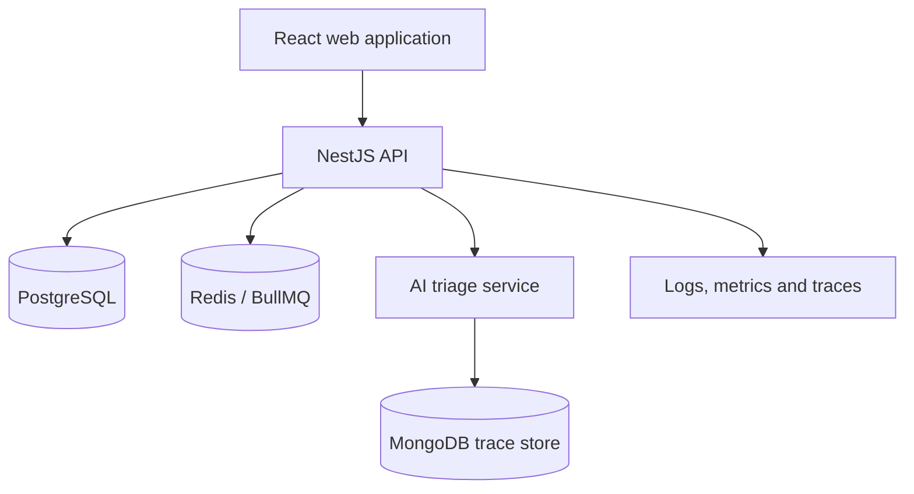

# Secure Service Operations Platform

[](https://github.com/marsharine-cs/secure-service-operations-platform/actions/workflows/foundation-checks.yml)


A production-minded, multi-tenant service operations platform for managing customer cases, team workflows, audit history, analytics, and AI-assisted triage with human approval.

> **Current status:** Project foundation and architecture planning. The repository intentionally distinguishes planned capabilities from implemented capabilities.

## Why this project exists

Entry-level developers are often asked to demonstrate more than isolated coding exercises. This project is designed to show how a developer reasons about a complete system: product requirements, secure data boundaries, API contracts, testing, delivery, observability, documentation, and responsible AI.

The project also builds on my background in technical support, education, IT/security, AI evaluation, and frontend development.

## Planned users

- **Support agent:** Creates, updates, and resolves service cases.
- **Team lead:** Assigns work, reviews escalations, and monitors queues.
- **Organization administrator:** Manages members, roles, and organization settings.
- **Auditor:** Reviews immutable activity history.
- **Platform operator:** Monitors service health and investigates incidents.

## Planned MVP

- Multi-tenant organizations and user membership
- Role-based access control
- Service-case lifecycle and assignment
- Search, filtering, comments, and audit history
- Dashboard and operational analytics
- Documented REST API and webhook delivery
- Background jobs for asynchronous work
- AI-assisted case classification and summarization
- Required human approval before AI suggestions affect a case
- Automated tests, CI checks, containers, and observability

## Target architecture



The diagram is a target, not a claim that these components are already implemented. See [Architecture](docs/ARCHITECTURE.md) and the [decision records](docs/adr/).

## Technology direction

| Area | Planned technology | Purpose |
|---|---|---|
| Web | React, TypeScript, Material UI | Accessible operational interface |
| Client state | Redux Toolkit, TanStack Query | Predictable UI and server-state management |
| API | NestJS, TypeScript, OpenAPI | Modular, documented service boundary |
| Primary data | PostgreSQL | Transactional multi-tenant data |
| Jobs/cache | Redis, BullMQ | Reliable asynchronous processing |
| AI service | Python, FastAPI, LangGraph | Explainable assisted triage workflow |
| AI traces | MongoDB | Flexible model-run and evaluation records |
| Testing | Vitest/Jest, React Testing Library, MSW, API tests | Confidence across system boundaries |
| Delivery | Docker Compose, GitHub Actions, AWS | Repeatable local and cloud delivery |
| Operations | Structured logs, metrics, traces, health checks | Production diagnostics |

## Repository map

```text
apps/
  web/                 React client
  api/                 NestJS API
services/
  ai-triage/           Python AI service
packages/
  contracts/           Shared schemas and generated types
docs/
  adr/                 Architecture decision records
infra/                 Deployment and infrastructure definitions
.github/               CI and collaboration templates
```

Directories currently contain boundary documents. Application code will be added issue by issue so that each decision and implementation step is understandable.

## Delivery principles

1. **Security at the boundary:** Every tenant-owned query must enforce organization scope.
2. **Human-controlled AI:** AI proposes; authorized people approve.
3. **Tests describe behavior:** Important workflows receive tests before they are considered complete.
4. **Observable by design:** Logs, metrics, traces, and health checks are product requirements.
5. **Small, reviewable changes:** Work moves through linked issues and pull requests.
6. **Honest documentation:** Roadmap items are never presented as completed features.

## Getting started

The runnable development environment will be introduced in the first implementation issue. Until then, review:

1. [Product requirements](docs/PRODUCT_REQUIREMENTS.md)
2. [Architecture](docs/ARCHITECTURE.md)
3. [Roadmap](docs/ROADMAP.md)
4. [Threat model](docs/THREAT_MODEL.md)
5. [Contributing guide](CONTRIBUTING.md)

## Definition of done

A feature is complete only when:

- Acceptance criteria are met.
- Authorization and tenant isolation are considered.
- Tests cover the important behavior.
- Error and empty states are handled.
- Relevant documentation is updated.
- Observability is added where operationally useful.
- The change is linked to an issue and reviewed through a pull request.

## Project board and progress

The GitHub issues are the source of truth for implementation work. The roadmap groups those issues into interview-friendly phases that can be built and explained one at a time.

## License

Released under the [MIT License](LICENSE).
