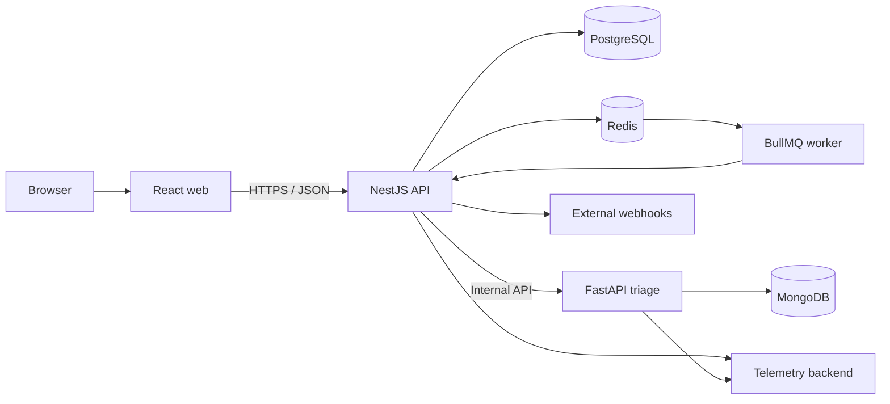
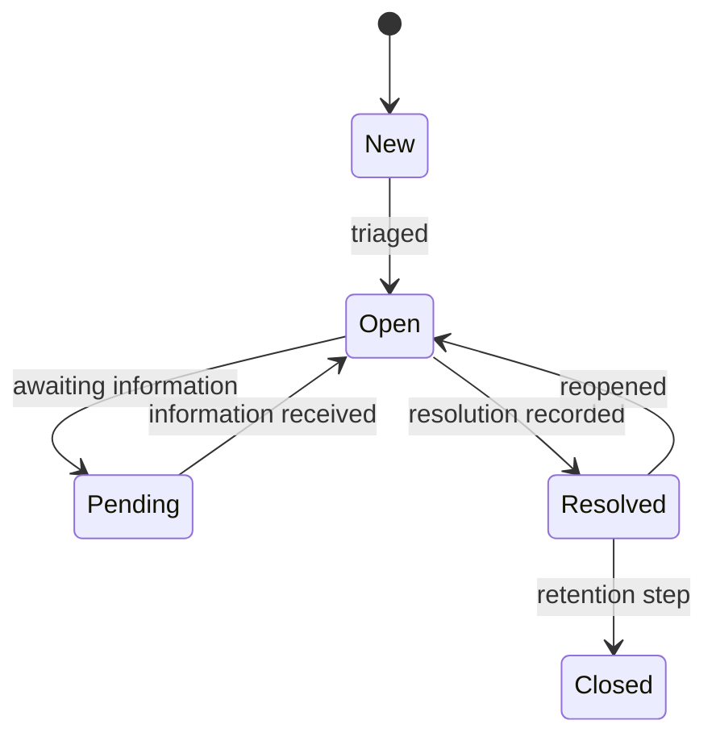

# Architecture

## Context

The platform uses explicit service boundaries to demonstrate full-stack engineering without turning the MVP into unnecessary microservices. The main API owns operational truth. A separate AI service isolates model orchestration and evaluation concerns.

## Container view

## Responsibilities

### React web application

- Presents accessible agent, lead, and administrator workflows.
- Uses TanStack Query for server state.
- Uses Redux Toolkit only for cross-cutting client state.
- Never decides authorization; it reflects permissions returned by the API.

### NestJS API

- Owns authentication, authorization, tenant scoping, and business rules.
- Exposes a versioned REST API and OpenAPI contract.
- Coordinates transactions and writes audit events.
- Enqueues asynchronous work after successful state changes.

### PostgreSQL

- Stores organizations, memberships, cases, comments, assignments, and audit events.
- Uses migrations and constraints as part of the domain model.
- Enforces organization identifiers on tenant-owned records.

### Redis and BullMQ

- Runs retryable jobs such as triage requests and webhook deliveries.
- Uses bounded retries, exponential backoff, and dead-letter visibility.
- Does not become the source of truth for business records.

### AI triage service

- Produces structured suggestions, not authoritative decisions.
- Validates model output before returning it.
- Stores model-run metadata and evaluation traces separately.
- Supports deterministic substitutes during local tests.

### Observability

- Correlation identifiers connect web, API, worker, and AI activity.
- Structured logs omit secrets and sensitive payloads.
- Metrics cover request performance, errors, queue health, and model outcomes.
- Traces focus on cross-service operations.

## Tenancy model

Every tenant-owned table includes `organization_id`. The authenticated membership establishes the allowed organization context. Repository methods require that context explicitly; retrieving tenant data by record ID alone is prohibited.

Defense in depth will include:

- authorization guards;
- organization-scoped repository methods;
- database constraints and indexes;
- negative integration tests;
- audit events for sensitive changes.

## Case state model

Exact transition permissions will be captured in tests and API documentation.

## Failure strategy

- Client requests use stable error shapes and correlation IDs.
- Database changes that belong together use transactions.
- Jobs are idempotent and safe to retry.
- Webhook attempts retain delivery status without logging secrets.
- AI timeouts degrade to manual triage rather than blocking case creation.

## Decision records

- [ADR 0001: Monorepo and service boundaries](adr/0001-monorepo-and-service-boundaries.md)
- [ADR 0002: Human-in-the-loop AI](adr/0002-human-in-the-loop-ai.md)
