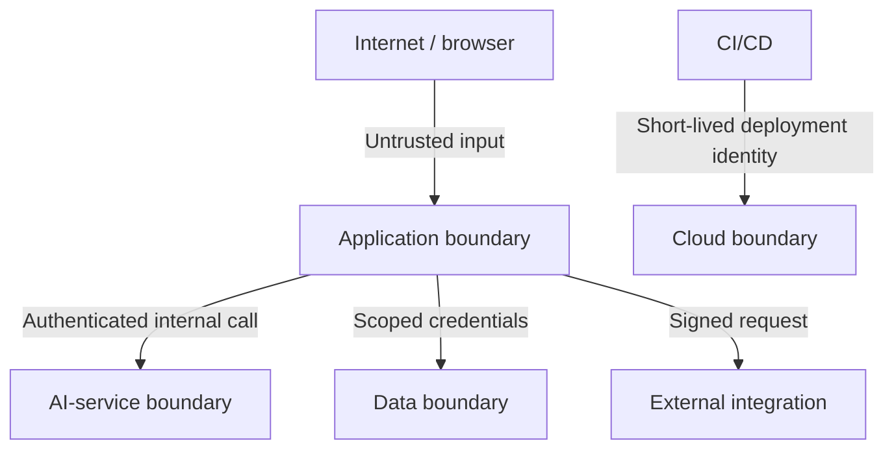

# Threat Model

## Scope

This document covers the planned web application, API, worker, AI service, data stores, webhooks, CI pipeline, and cloud deployment.

## Assets

- Organization and membership data
- Service cases and internal comments
- Authentication tokens and service credentials
- Audit history
- Webhook secrets
- AI prompts, outputs, and evaluation traces
- Source code and deployment credentials
- Service availability and operational telemetry

## Trust boundaries

## Primary threats and controls

| Threat | Example | Planned controls |
|---|---|---|
| Broken tenant isolation | User guesses another case ID | Mandatory organization scoping, authorization tests, audit logs |
| Privilege escalation | Agent calls administrator endpoint | Role guards, deny-by-default policy, server-side checks |
| Injection | Malicious search or webhook payload | Schema validation, parameterized queries, output encoding |
| Credential exposure | Secret committed or logged | Environment secrets, scanning, redaction, least privilege |
| Webhook forgery/replay | Fake external event | Signature verification, timestamp window, idempotency key |
| Queue abuse | Duplicate or poison jobs | Idempotent handlers, bounded retry, dead-letter visibility |
| AI prompt injection | Case text instructs the model to bypass rules | Treat content as data, constrained output schema, no tool authority |
| Unsafe AI decision | Model changes priority incorrectly | Human approval, confidence metadata, audit event, rollback |
| Sensitive-data leakage | Case details sent to logs or models | Data minimization, redaction, provider controls, safe fixtures |
| Supply-chain compromise | Malicious dependency or action | Lockfiles, Dependabot, review, version pinning, scanning |
| Denial of service | Expensive search or model request | Rate limits, pagination, timeouts, quotas, circuit breaking |

## Abuse cases to test

- A member of Organization A requests a case owned by Organization B.
- An agent attempts to assign administrator privileges.
- A replayed webhook tries to create the same event twice.
- A job fails repeatedly and enters a visible terminal state.
- Case content contains instructions aimed at the AI service.
- Model output does not match the required schema.
- The AI service is unavailable during case creation.
- Logs are checked for tokens, passwords, and case content.

## Review cadence

Update this threat model when:

- a new external integration is added;
- authorization or tenancy changes;
- a new class of sensitive data is stored;
- AI tools gain new capabilities;
- the deployment boundary changes;
- an incident reveals an unmodeled threat.
